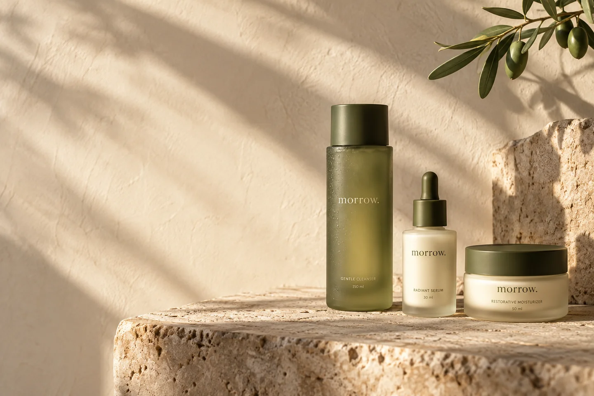

# Overcomer Israel · Oviks Media

**Graphic design & Shopify portfolio**

Selected work prepared for FullPond’s **Senior Graphic & Shopify Designer** role. Six self-initiated brand concepts connect visual identity, packaging and campaign direction to working Shopify storefronts.

**[Explore the portfolio](https://oviks-morrow-portfolio.netlify.app/)** · [Contact Overcomer Israel](mailto:oviks.israel@gmail.com)


> The portfolio is the main review link. It opens without a password and provides the visitor password beside every Shopify demo. This repository contains the build files and project documentation.

## Selected projects

[](https://oviks-morrow-portfolio.netlify.app/morrow)

| Project | Design focus | Case study | Shopify demo | Visitor password |
| --- | --- | --- | --- | --- |
| **MORROW** | Skincare · Identity & packaging | [View](https://oviks-morrow-portfolio.netlify.app/morrow) | [Open](https://oviks-portfolio-demo.myshopify.com/) | suweid |
| **RIFT** | Cycling · Identity & campaign | [View](https://oviks-morrow-portfolio.netlify.app/rift) | [Open](https://rift-portfolio-demo.myshopify.com/) | lowcia |
| **SABLE** | Leather accessories · Art direction | [View](https://oviks-morrow-portfolio.netlify.app/sable) | [Open](https://sable-portfolio-demo.myshopify.com/) | chowck |
| **DAYBREAK** | Coffee · Label system & packaging | [View](https://oviks-morrow-portfolio.netlify.app/daybreak) | [Open](https://daybreak-portfolio-demo.myshopify.com/) | nowped |
| **ARC** | Lighting · Product presentation | [View](https://oviks-morrow-portfolio.netlify.app/arc) | [Open](https://arc-portfolio-demo.myshopify.com/) | reepro |
| **SIDE B** | Records · Cover design & collection | [View](https://oviks-morrow-portfolio.netlify.app/side-b) | [Open](https://side-b-portfolio-demo.myshopify.com/) | yeitwu |

## What to explore

- **Visual systems:** typography, colour, layout, label masters and cover artwork.
- **Storefront design:** responsive product presentation, explicit choices and consistent brand direction.
- **Shopify implementation:** Liquid themes, catalog products and variants, native product forms and cart interactions.
- **Case studies:** the brief, design decisions, platform translation and project scope.

All six brands are fictional portfolio concepts. The Shopify development stores demonstrate shopping interactions with illustrative products and prices; checkout, payments and fulfillment are inactive. Visitor passwords are demo access codes, never account credentials.

## Working with the files

The portfolio is a lightweight static build. Node.js is sufficient for building and previewing; no package installation is required.

```sh
node morrow-portfolio/build-portfolio.mjs
node morrow-portfolio/preview.mjs
```

Open http://127.0.0.1:4391/. Edit the authored source files, then rebuild the deployment folder.

| Location | Purpose |
| --- | --- |
| `morrow-portfolio/src/` | Portfolio overview, Morrow and RIFT case studies |
| `morrow-portfolio/projects/` | Other case studies, graphic assets and project records |
| `morrow-portfolio/assets/` | Shared styling, portrait and overview assets |
| `shopify-stores/source/` | Shared native Shopify components |
| `shopify-stores/{slug}/theme/` | Complete themes for the five newer stores |
| `shopify-skincare/theme/` | Existing Morrow Shopify theme |

**[Maintainer guide](docs/maintainer-guide.md)** · [Shopify migration & verification](docs/shopify-migration.md)

The latest Shopify migration was checked with Shopify Theme Check, fresh visitor access and native add/update/remove cart flows. Verification records are under `shopify-stores/evidence/`. Historical prototypes and media provenance are retained with their project sources.

## Contact

**Overcomer Israel** · Oviks Media

[oviks.israel@gmail.com](mailto:oviks.israel@gmail.com)
